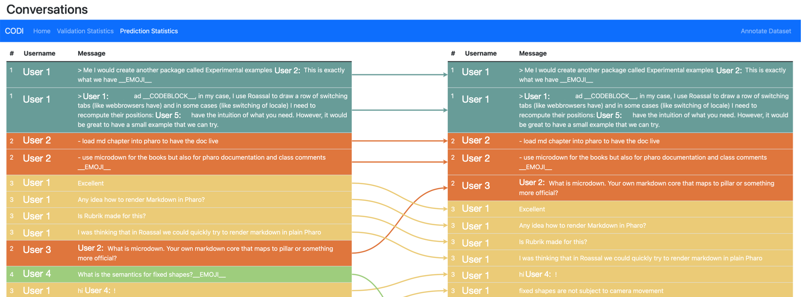

<h1 align="center">CODI
<hr>Conversation Disentanglement Microservice</h1>

<div align="center">

[//]: # (  )
  <br>
  <i><b>CODI is an accessible and user-friendly REST microservice that can automate the disambiguation
    of a set of instant messages to form conversations by leveraging state-of-the-art machine learning algorithms.</b></i>
</div>

<hr>
<div align="center">
  
  <i>CODI Web User Interface: Screenshot &mdash; Messages (left) and color coded conversations (right) with predicted disentanglement (arrows).</i>
</div>
<hr>

# Requirements
To run the webserver and correctly disentangle conversations, you will need the following:

- Python (v3.10)
- (optional, see [how to compile MEGAM](#megam)) OCaml (v4.12.0)

# Conda environment
This project was developed in a custom Conda environment. To recreate such an environment,
execute the following commands:

```sh
conda env create -f ./environment.yml
conda activate codi
```

To deactivate and delete the environment, execute the following commands:

```sh
conda deactivate
conda remove --name codi --all
```

# How to run
### Django secret
To run the webserver locally, you first need to generate a Django secret code — which can be done with the following
command (from the root of this repository):

```sh
python -c 'from django.core.management.utils import get_random_secret_key; print(get_random_secret_key())'
```

Once the key has been generated, create a `.env` file in the repository's root. The `.env` file must be structured as
follows:

```env
DJANGO_DEBUG=True
DJANGO_SECRET_KEY="your-key"
```

### <a name="megam"></a> (optional) Compile MEGAM Max Entropy Classifier
We include the MEGAM Max Entropy Classifier's latest version from
[Hal Daume III](https://users.umiacs.umd.edu/~hal/megam/version0_91/).
To compile it you can run the following commands:

```sh
cd codi/api/utils/megam_0.92
make clean
make depend
make
```

### Run CoDi
You can start a local instance of CoDi with the provided `run_server.sh` script:

```sh
cd scripts
chmod +x ./run_server.sh
./run_server.sh
```

# IDE Run and Debug configurations (PyCharm)

Run and debug configurations are available in the directory `.run` for users who have
[PyCharm Professional](https://www.jetbrains.com/pycharm/).
To use them, open this repository in PyCharm; it will automatically import the configurations for you.

First, navigate to the Django configuration "Run server" > **Environment** > **Environment variables**.
Here you need to add a new environment variable with key `DJANGO_SECRET_KEY` and value `your-key`
and an environment variable with key `DJANGO_DEBUG` and value `True` (the key is the same as the one you generated
earlier).

The compound configuration "Run server" will compile the megam binary and run the server. If you need to run the
server, you can use the Django configuration. "Start server".

# Docker image
We also offer a Docker image. The Dockerfile and docker-compose for the image can be found in the project's root
directory. This image can also be built using the Docker configuration "Compose" (for PyCharm Professional users).

Before running this configuration, ensure that you have a file named `.env.production` in the repo's root directory.
The file needs to have the same structure as the `.env` described earlier. In this case, we recommend setting the
`DJANGO_DEBUG` variable to `False`.

# Datasets for training, testing, and validation

`datasets` contains some example datasets (ANNOT or JSON formats) taken from previously published papers.

`datasets/annot/from_previous_papers` and `datasets/json/from_previous_papers` include datasets previously published in:
 - Elsner, M., & Charniak, E. (2010). [Disentangling chat](https://direct.mit.edu/coli/article/36/3/389/2062/Disentangling-Chat). _Computational Linguistics_, 36(3), pp. 389-409, ACL, 2010.
 - Chatterjee, P., Damevski, K., Kraft, N. A., & Pollock, L. (2020). [Software-related Slack chats with disentangled conversations](https://dl.acm.org/doi/abs/10.1145/3379597.3387493). _In Proceedings of MSR 2020 (International Conference on Mining Software Repositories)_, pp. 588-592, ACM, 2020.
 - Subash, K. M., Kumar, L. P., Vadlamani, S. L., Chatterjee, P., & Baysal, O. (2022). [DISCO: A Dataset of Discord Chat Conversations for Software Engineering Research](https://olgabaysal.com/pdf/MuthuSubash_MSR2022_DataShowcase.pdf). _In Proceedings of MSR 2022 (International Conference on Mining Software Repositories)_, ACM, 2022.

# Example: how to train and disentangle (predict)
On the Hompage of CoDi you can train the model from scratch and disentangle and visualize an example dataset:
 1. Check that the Train operation is selected (already selected by default)
 2. Select Slack as the type of platform you want to train on
 3. Leave all the features enabled
 4. Drag and drop the training set `datasets/annot/from_previous_papers/training.annot` in the page
 5. Wait for the operation to complete (console debug information will inform you about progress)
 6. When the Train operation is completed you can select a Predict operation and a Discord platform and drag and drop 
     one of the Discord datasets to perform a disentanglement prediction
     (e.g., `datasets/annot/from_previous_papers/clojure_Feb2020-Apr2020.annot`)
 7. After a successful validation (try, for example, `datasets/json/from_previous_papers/validation.json`) you can also
     check the Statistics box for information about disentanglement performance (e.g., Accuracy, F1-score)

# License

Copyright (c) 2023 Edoardo Riggio, Marco Raglianti, Michele Lanza, REVEAL @ Software Institute - USI, Lugano, Switzerland

Distributed under the MIT License. See [LICENSE](LICENSE.txt) for more information.


# Contacts 

- REVEAL - https://reveal.si.usi.ch
